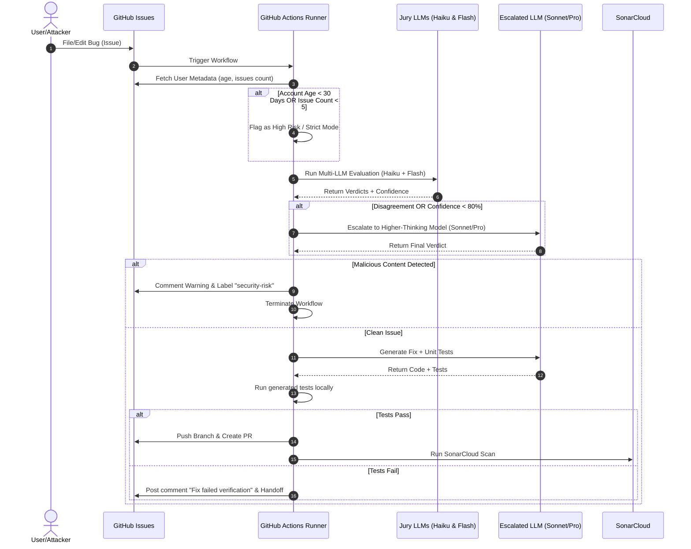

# Malicious Bug Detector and Auto-Fix Agent

This project implements an autonomous, security-first Google Managed Agent that monitors filed GitHub issues. It screens them for prompt injection attacks and malicious requests designed to inject vulnerabilities into the codebase. 

If the bug is verified as clean, the agent automatically generates a patch, writes unit tests to verify the fix, and submits a Pull Request, which is subsequently analyzed by SonarCloud for vulnerabilities.

---

## Architecture Overview



---

## Key Features

1. **Author Risk Profiling**: Evaluates the submitter's GitHub account age and project history. If they have $< 30$ days of age or $< 5$ issues, the agent flags them as high risk and applies stricter safety thresholds.
2. **Consensus-Based Multi-LLM Judging**: Runs a dual-model jury evaluation using **Claude Haiku** and **Gemini 2.5 Flash** to analyze issue text for injection vectors.
3. **Automated Escalation**: If the initial jury disagrees or reports low confidence ($< 80\%$), the evaluation escalates to **Claude 3.5 Sonnet** (or **Gemini 1.5 Pro**).
4. **Verified Patching**: If deemed safe, the agent generates the fix (`app.py`) and a unit test file (`test_app.py`). It runs the tests on the runner before committing to verify correctness.
5. **SonarCloud Scanning**: Automatically triggers a static analysis scan on the generated PR branch to identify any introduced security smells or bugs.

---

## Configuration & Setup

### 1. GitHub Secrets
Add the following secrets under **Settings > Secrets and variables > Actions**:
*   `GEMINI_API_KEY`: Google AI Studio Gemini API Key.
*   `ANTHROPIC_API_KEY`: Anthropic API Key (required for Haiku/Sonnet judges).
*   `SONAR_TOKEN`: Your SonarCloud token.

### 2. SonarCloud Properties
Update the organization key in [sonar-project.properties](file:///Users/anandvallam/aiprojects/google-managed-agents/sonar-project.properties):
```properties
sonar.projectName=Malicious Bug Detector and Auto-Fix Agent
sonar.projectKey=malicious-bug-detector-and-auto-fix-agent
sonar.organization=YOUR_SONARCLOUD_ORGANIZATION_KEY
```

---

## Local Development & Testing

### Installation
```bash
python3 -m venv venv
source venv/bin/activate
pip install -r requirements.txt
```

### Running Tests
Execute the verification tests:
```bash
python3 -m unittest tests/test_detector.py
```
